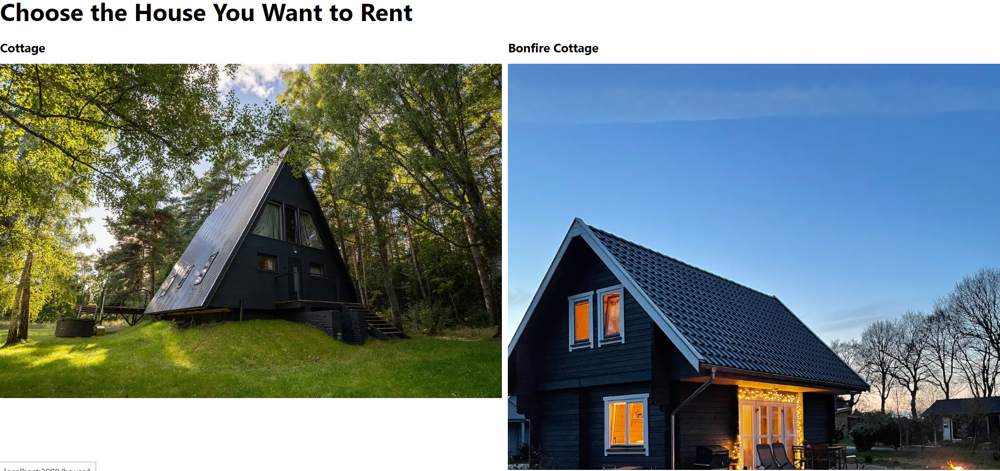
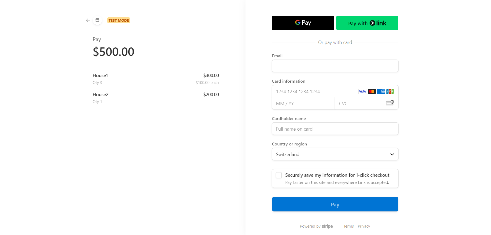

# RentaHouse
This chat app was developed using React in the frontend, node.js in the backend.

## Preview
1. There is a landing page with four different houses, you can click on each of them to get a few further pictures like in airbnb.

2. You can fake rent a house for a week, by clicking on the "pay for a week" button, which will redirect you to the payment page. This page won't actually charge you, but it will show you a confirmation message and how it would actually look like to rent it. 

